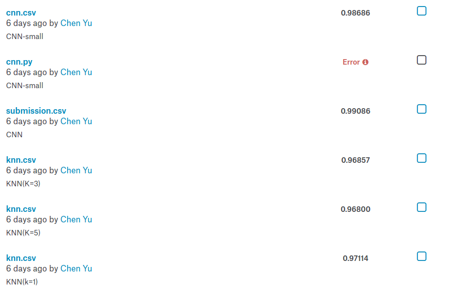
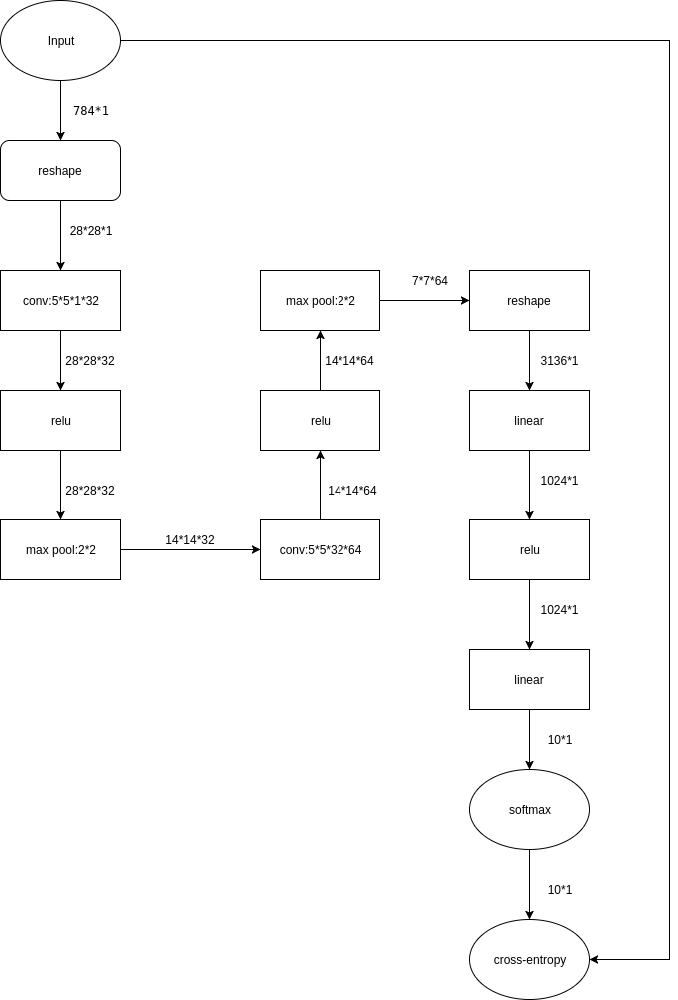
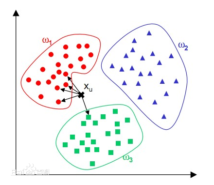

# 《人工智能导论》实验三实验报告

计54 陈宇 2015011343

## 实验目的

[Digit Recognizer](https://www.kaggle.com/c/digit-recognizer)是[Kaggle](https://www.kaggle.com/)上的一个手写数字识别比赛，要求选手根据网站提供的训练数据进行训练，然后标注出另一部分待检测图片的数字。

本次实验要求学生参与Digit Recognizer比赛，与世界各地的科学家一较高低，并比较不同算法对于手写数字识别的效果差异。

## 最终提交结果展示

在实验中，我实现了CNN和KNN算法并进行了一些比较，最终CNN的效果最好，**正确率达到了$0.99086$，总提交次数为6次**。

    <table>
        <thead>
            <tr>
                <th>算法</th>
                <th>正确率</th>
                <th>备注</th>
            </tr>
        </thead>
        <tbody>
            <tr>
                <td>CNN</td><td>0.99086</td><td>训练了一晚上</td>
            </tr>
            <tr>
                <td>CNN(small)</td><td>0.98686</td><td>训练时间较短</td>
            </tr>
            <tr>
                <td>KNN(K=1)</td><td>0.97114</td><td>跑得贼块</td>
            </tr>
            <tr>
                <td>KNN(K=5)</td><td>0.96800</td><td>跑得贼块</td>
            </tr>
            <tr>
                <td>KNN(K=3)</td><td>0.96857</td><td>跑得贼块</td>
            </tr>
        </tbody>
    </table>

## CNN(卷积神经网络)

由于我们的问题是识别出一张图片上的数字，对于此类问题，CNN(卷积神经网络)的表现非常优秀，故我在实验中使用Tensorflow构造了一个CNN来解决这个问题，该CNN的数据流图如下：

该神经网络是仿照MINST的网络构建的，图片向量先经过`reshape`变成$28*28$的大小，然后使用$32$个$5*5$的卷积核进行卷积，之所以选择$5*5$大小的卷积核，是考虑到输入图片的大小是$28*28$，为了最终得出的模型具有鲁棒性，能够应对图片的一些旋转和平移，所以卷积核应该大一点，但是如果卷积核太大，很可能会导致图片的不同特征被混在了一起，而且卷积核越大，需要训练的参数也越多，在数据集不变的情况下，会导致训练时间增长且最终结果变差（出现过拟合），综上，最终选定的卷积核大小为$5*5$。

经过一层卷积之后，数据变成了$28*28*32$的大小，此时将输入送入一个`relu`层，`relu`的算法原理是将每个数据和$0$取$max$，其作用是模拟生物神经元的重激活过程。然后将经过`relu`的数据送入一个$2*2$的`max pool`，其内部原理是对矩阵的每$2*2$的元素取一个最大值，最终得到的数据大小为$14*14*32$。`max pool`在此处充当一个非线性层，其作用是和之前的卷积层相互作用，使得最终测试的图片即使经过一些旋转和平移，`max pool`层得出的结果也不会相差太大。

只有一层的卷积是不足够的，所以我在上面的基础上再添加了相同的三层（卷积，`relu`,`max pool`）。而为什么没有将两个卷积层直接相连，是由于两个连续的线性层和一个线性层是等价的，所以需要使用非线性层(`relu`,`max pool`)将其隔开，同理，第二个线性层也需要和之后的全连接层用非线性层隔开。第二个`max pool`输出的数据是$7*7*64$大小的。

在数据集足够的情况下，还可以添加第三个卷积层，但是受限于本实验中的数据集大小，以及三层卷积需要的训练时间太长，所以我在实验中并没有添加更多的卷积层。

经过了两层卷积层之后，再将数据送入一个全连接层，将数据维度变成$1024$，此步骤的目的是在前两层卷积的基础上，进一步提取特征，为之后一层做准备。

将上一层全连接的数据再送入一个全连接，将数据唯独变成$10$，此层的输出就是最终的输出的。值得一提的是，前面说过两个相邻的线性层和一个线性层的作用是等价的，但是我在此处为什么放置两个相邻的全连接层的？实际上在计算中，这两个全连接层和一个全连接层的效果确实是等价的，但是我在实验中，在第一个全连接层出添加了一个`dropout`，目的是为了防止出现过拟合的情况，所以在训练中这两层全连接并不等同于一个全连接。

最后，使用`softmax`进行归一化，得到的$10$维向量就是最终每个数字的概率。

在实验中，我使用“交叉熵”（cross-entropy）作为损失函数，其表达式如下：

其中，$y$是我们预测的概率分布,$y'$是实际的分布。

在训练中，我将数据集分成两份，一份是训练集，占总数据集的$90%$，另一份是测试集，占总数据集的$10%$。每次迭代放入$200$条数据，迭代了$100000$次，由于使用CPU进行训练太慢，所以我在电脑在晚上训练，第二天早上查看训练结果，由于没有计时，所以并不知道确切的时间，**最终测试正确率为0.99086**。

此外，我在这种模型的基础上做了一些小修改，训练了一个参数量略小的CNN，但是由于CPU训练太慢，导致并没有训练足够的时间，最终测试结果正确率为0.98686，猜测如果给足训练时间应该和上面的模型正确率差不太多。

## KNN(k-Nearest Neighbor)

KNN算法也叫K临近，是数据挖掘领域最简单的算法之一，其算法原理可以用如下图片描述：

在本实验中，将每张图片看作一个$784$维空间中的一个点。对于一个需要计算的图片向量，计算空间中离它最近的$k$个点，然后统计这$k$个点分别的属性，取出现次数最多的数字作为需要计算图片的数字。

我首先测试了$k=1$的情况，也就是待计算图片的数字取欧式空间中离它最近点的数字。虽然算法非常简单，但是测试结果异常的好，达到了$0.97114$。

然后我继续测试了$k=5$和$k=3$的情况，但是测试结果分别是$0.96800$和$0.96857$，不仅没有超过$k=1$的情况，最终效果反而变差了。

## 实验总结

从试验结果来看，CNN在图片相关的领域确实如其传闻那样表现优秀，只要有足够的数据量和计算能力，CNN的力量应该是非常强大的。

同时，传统算法在某些时候的表现依然不错，比如KNN能够取得$0.97114$的成绩确实出乎我的意料，然而KNN算法存在瓶颈，它并不能永远在数据量增大的情况下效果变好，很多时候反而会变差，这也是其相比于CNN不足的地方。
